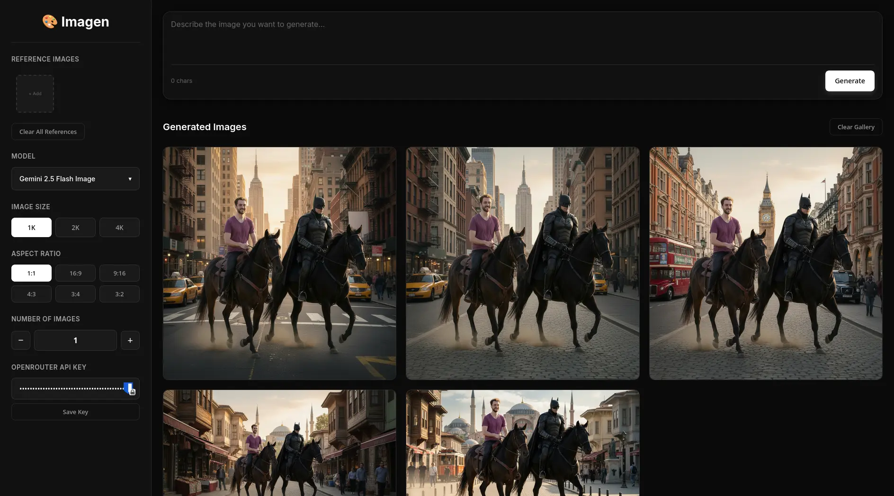
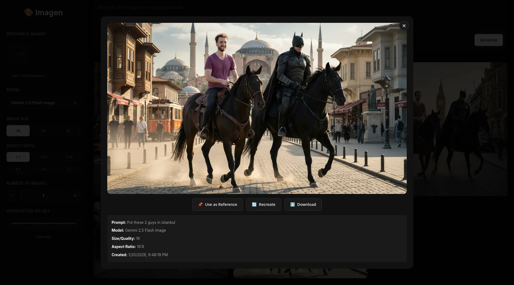

# Imagen - AI Image Generation Tool

A powerful client-side AI image generation tool using OpenRouter API. Generate thumbnails, artwork, and creative images with multiple state-of-the-art models.




## ✨ Features

### 🎨 Multi-Model Support (auto-updating)
The model list is fetched from OpenRouter at startup, so **new image models
appear on their own** — no code change, no release needed. That currently
surfaces **43 image models** (Gemini, GPT Image, FLUX, Seedream, Qwen Image,
Recraft, Krea, Riverflow, Grok Imagine, MAI).

- Every image model with a live provider is listed automatically
- **Searchable picker** showing the model id, a **Good / Better / Best** tier
  and an estimated **price per image**
- Cached for 24 hours; a **Refresh** button forces an update
- A bundled fallback list keeps the app usable if OpenRouter is unreachable
- A saved model that has since been retired is detected and swapped out

### 🔀 Compare Models Side by Side
Send one prompt to up to **three models at once** and compare the results in
the gallery.

- Hit **+** next to any model in the picker to add it to the comparison
- Each model generates your full image count, in parallel
- Every image is tagged with the model that produced it
- Leave the comparison empty for normal single-model generation

### 💰 Session Cost
A running total of what you've spent, taken from the cost OpenRouter reports
for each generation — not an estimate.

- Exact per-call cost via OpenRouter's usage accounting
- Falls back to the catalogue price estimate if a provider omits it, and marks
  the total with `≈` so you know it's approximate
- Shows what the next run will cost at your current settings, before you press
  Generate
- **Reset** to start a new session

### 📐 Flexible Output Options
- **Resolution**: 1K, 2K, 4K (Gemini models)
- **Aspect Ratios**: 1:1, 16:9, 9:16, 4:3, 3:4, 3:2
- **Batch Generation**: Up to 8 images at once

### 🖼️ Reference Image Support
- Upload unlimited reference images
- Drag & drop support
- Use generated images as references
- Click X to remove individual references

### 💾 Persistent Storage
- **IndexedDB storage**
- Store hundreds of images
- Images persist across browser sessions

### 🎯 Gallery Features
- View all generated images
- Delete individual images (hover to reveal 🗑️ button)
- Click any image for full view + metadata
- Clear entire gallery option

### ♻️ Recreate Feature
- Click any image to restore its original settings
- Instantly iterate on previous generations

## 🚀 Quick Start

1. Clone this repository
2. Start a local server:
   ```bash
   python3 -m http.server 8080
   # or
   npx serve .
   ```
3. Open http://localhost:8080
4. Enter your OpenRouter API key
5. Write a prompt and click Generate!

## 🔑 Getting an OpenRouter API Key

1. Go to [OpenRouter](https://openrouter.ai/)
2. Create an account
3. Navigate to **Keys** section
4. Create a new API key
5. Copy and paste it into the tool

## 🔒 Privacy & Security

This is a **100% client-side application**:

- ✅ API keys are stored in YOUR browser only
- ✅ Generated images are stored in YOUR browser only (IndexedDB)
- ✅ No data is sent to any server except OpenRouter API
- ✅ Safe to deploy as a static website

## ⌨️ Keyboard Shortcuts

| Shortcut | Action |
|----------|--------|
| `Ctrl + Enter` | Generate images |
| `Escape` | Close image modal |

## 🛠️ Tech Stack

- **Frontend**: Pure HTML/CSS/JavaScript (no dependencies)
- **API**: OpenRouter for model access + `/api/v1/models` for model discovery
- **Storage**: IndexedDB for image persistence
- **Styling**: Custom CSS with CSS variables

## 📁 Project Structure

```
imagen/
├── src/            # Source code (JS/CSS)
├── assets/         # Images and design assets
├── index.html      # Main entry point
└── README.md       # Documentation
```

## 📜 License

This project is licensed under the **GNU General Public License v3.0** (GPL-3.0).

You are free to:
- ✅ Use this software for any purpose
- ✅ Study how the software works and modify it
- ✅ Distribute copies of the software
- ✅ Distribute modified versions

Under the condition that:
- 📋 You include the original license and copyright notice
- 📋 You disclose the source code when distributing
- 📋 Modified versions must also be licensed under GPL-3.0

See the [LICENSE](LICENSE) file for full details.
